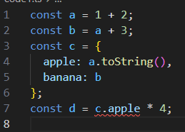

### TypeError 

Sse ha modificado el tipo de la propiedad `apple` en el objeto `c` a `string`, y luego se intenta multiplicar esa propiedad por 4 en la última línea. Este intento de multiplicación entre una cadena y un número provoca un `TypeError`, ya que no es posible realizar esta operación.

## Teoría 1
### Ejercicio 1
- **a:** TypeScript inferirá que `a` es de tipo `number` porque se le asigna el valor numérico `1042`.

- **b y c:** Ambas son inferidas como tipo `string` debido a que se les asignan valores de tipo cadena.

- **d:** TypeScript inferirá que `d` es un array de tipo `boolean[]` porque se le asigna un array de booleanos.

- **e:** `e` es inferida como un objeto con una propiedad `type` de tipo `string`. TypeScript infiere el tipo del objeto según la forma en que se le asigna el valor.

- **f:** TypeScript inferirá que `f` es un array que puede contener elementos de tipo `number` o `boolean`, ya que contiene tanto un número como un booleano.

- **g:** TypeScript inferirá que `g` es un array de tipo `number[]` porque contiene un número.

- **h:** TypeScript inferirá `h` como tipo `null`.
### Ejercicio 2
1. **Error TS2588: Cannot assign to 'i' because it is a constant.ts(2588):**
En esta línea, se está intentando asignar un nuevo valor (`4`) a una constante `i` que ha sido explícitamente tipada con el valor `3`. Esto resulta en un error (`TS2588`) porque las constantes no pueden ser reasignadas.

2. **Error TS2345: Argument of type '"5"' is not assignable to parameter of type 'number'.:**
El error (`TS2345`) se produce porque se está intentando añadir un tipo de dato string (`'5'`) que no es compatible con el tipo esperado (`number`) en el array.

3. **Error TS2322: Type '4' is not assignable to type 'never'.:**
Se está intentando asignar el valor `4` a una variable `k` de tipo `never`. El error (`TS2322`) ocurre porque `never` representa un tipo que nunca puede tener un valor, por lo que asignarle un valor es inválido.

4. **Error TS2571: Object is of type 'unknown'.:**
Aquí, la variable `l` está tipada como `unknown`, que es el tipo más seguro en TypeScript. Luego, se intenta multiplicar `l` por `2`, y TypeScript genera el error (`TS2571`) porque no se puede realizar una operación aritmética con un valor de tipo `unknown` sin antes realizar una comprobación de tipo.

### Ejercicio 3. Diferencia entre Clase y Interface en TypeScript

#### Clase

- **Definición:**
  - Una clase es una plantilla para crear objetos que encapsula comportamientos (métodos) y estado (propiedades).
  - Puede tener un constructor para inicializar las propiedades cuando se crea una instancia.

  
- **Implementación:**
  - Se utiliza para crear objetos concretos.
  - Puede contener métodos y propiedades con implementación.
  
- **Herencia:**
  - Puede heredar de otra clase utilizando la palabra clave `extends`.

- **Instanciación:**
  - Se puede crear instancias de una clase con el operador `new`.

#### Interface

- **Definición:**
  - Una interfaz es una estructura que define la forma que debe tener un objeto. Es un contrato que especifica qué propiedades y métodos debe tener un objeto.

- **Implementación:**
  - No tiene implementación directa de funcionalidades.
  - Las interfaces son útiles para declarar la forma que deben tener los objetos sin proporcionar la implementación.

- **Herencia:**
  - Puede extender otra interfaz utilizando la palabra clave `extends`.

- **Instanciación:**
  - No se puede instanciar directamente. Las interfaces no generan código JavaScript y solo existen en tiempo de compilación para verificar la estructura de los objetos.

#### Resumen

- Las clases crean instancias con implementación.
- Las interfaces definen la forma de los objetos.
- Clases pueden contener lógica, interfaces se centran en tipos.
